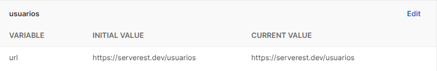
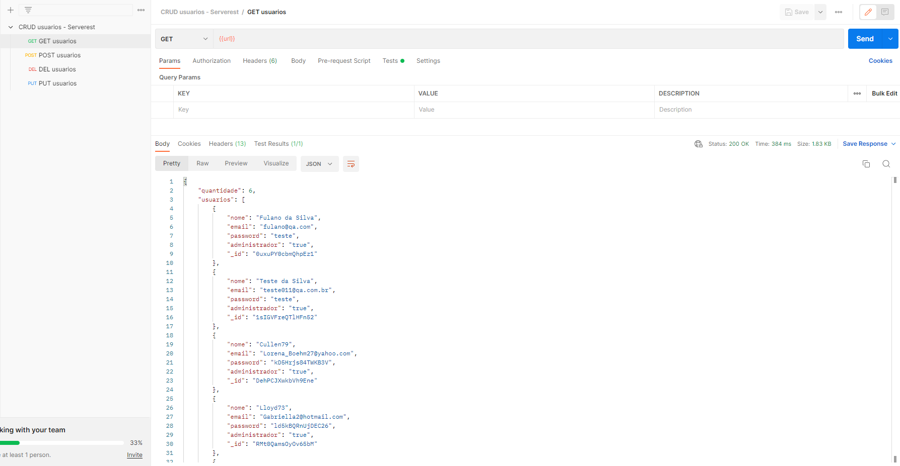
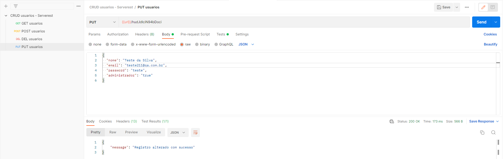
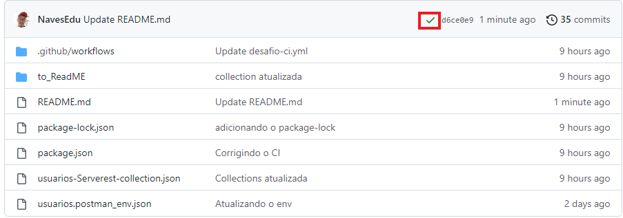
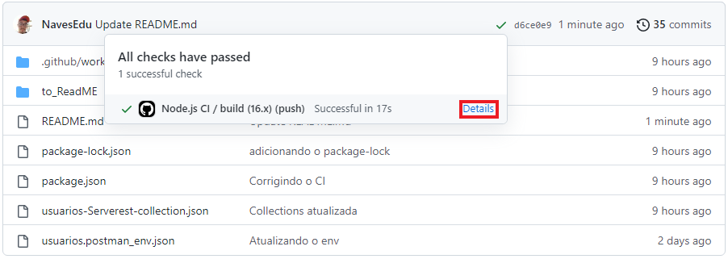
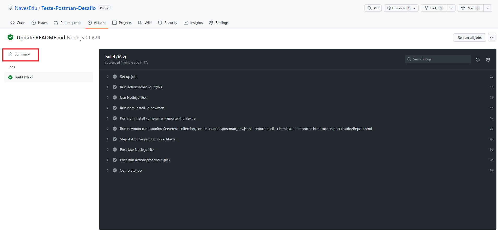
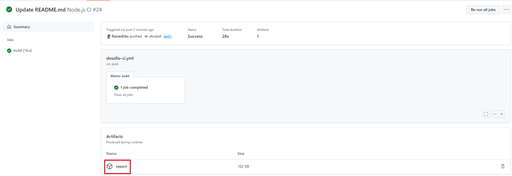
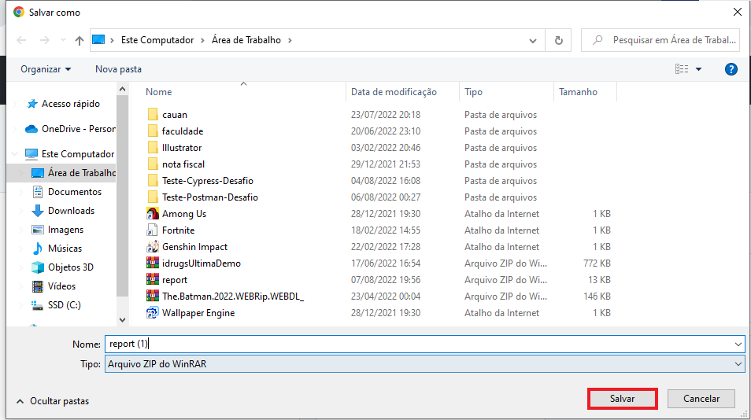
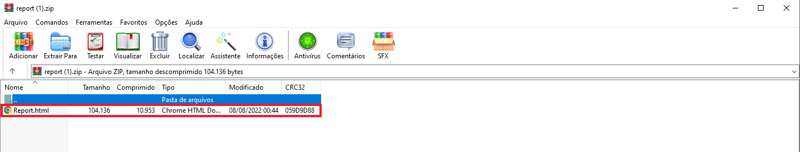
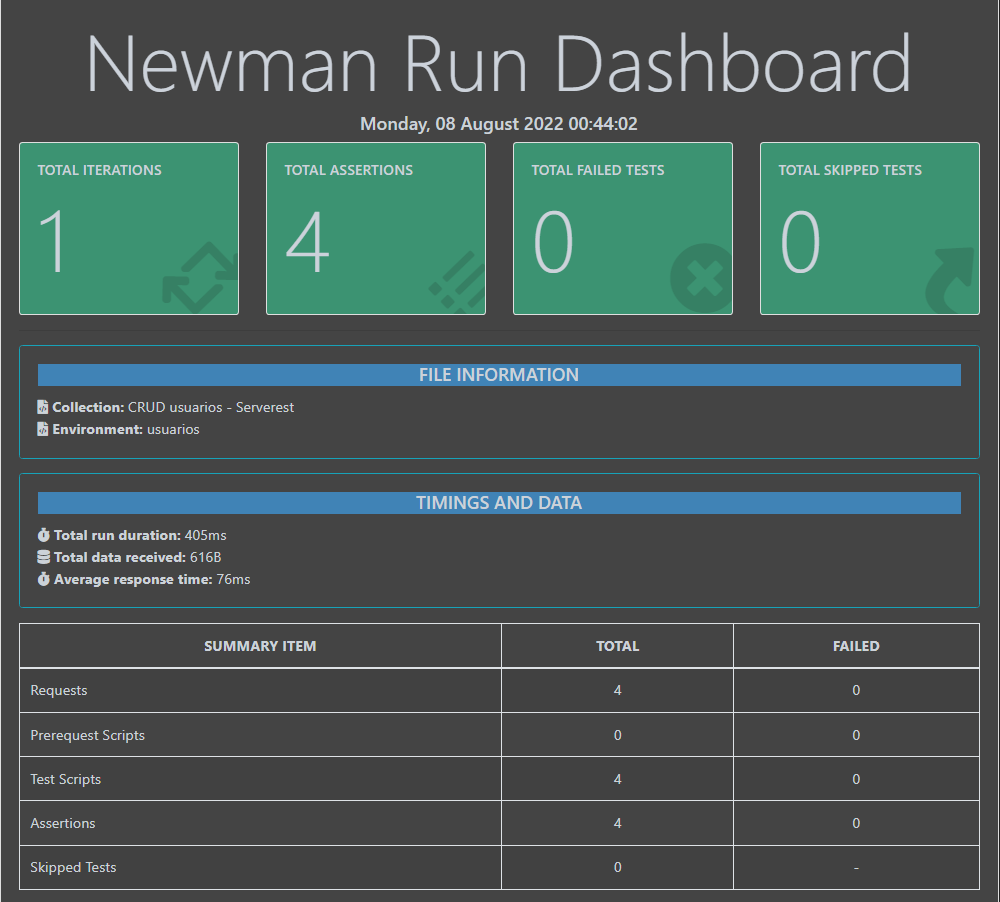

[](https://github.com/NavesEdu/Teste-Postman-Desafio/blob/main/.github/workflows/desafio-ci.yml)

# Postman Desafio

- [Sobre](#-sobre)
- [Como executar](#-como-executar)
- [Teste Postman](#-teste-postman)
- [CI](#-ci)

## 💻 Sobre

Este é um projeto usando Postman para criação de testes da API pública https://serverest.dev/, nesse projeto são testadas as funcionaldiades de realizar login na aplicação com / sem sucesso, utilizando o browser google chrome:
<br/>

## 🚀 Como executar

### Pré-requisitos

Antes de começar, você vai precisar ter instalado em sua máquina a seguinte ferramenta:

* [Postman](https://www.postman.com/downloads/)

### Clonando repositório

Para clonar o repositório em algum lugar na sua máquina, basta utilizar o comando abaixo:
```bash
$ git clone https://github.com/NavesEdu/Teste-Postman-Desafio
```
## Teste Postman:

## Iniciando a aplicação

1. Abra o Postman
2. Selecione o menu *File -> Import*
3. Selecione a aba *File*
4. Clique no botão *Upload Files*
5. Navegue até o diretório onde você salvou o arquivo e selecione os arquivos `usuarios-Serverest-collection.json` e o arquivo `usuarios.postman_env`
6. Clique no botão *Import*

## Fazendo os testes

* Environment criado dentro do Postman com a URL da API:
</p>
<p aligng="center">
  
</p>

* Teste da requisição GET, que retorna todos usuários já cadastrados:
<p aligng="center">
  
</p>

* Teste da requisição POST, que cadastra um usuário:
<p aligng="center">
  
</p>

* Teste da requisição DEL, que deleta um usuário, no caso do exemplo, nenhum registro foi deletado pois foi usado um ID qualquer:
<p aligng="center">
  
</p>

* Teste da requisição PUT, que atualiza o registro de um usuário, no caso do exemplo, foi usado o ID do usuário que foi cadastrado no exemplo da requisição POST:
<p aligng="center">
  
</p>

## CI:
Vendo os testes através de um CI criado com o GitHub Actions, utilizando o newman:

* Clique na verficação 
<p aligng="center">
  
</p>

* Clique em details
<p aligng="center">
  
</p>

* Clique em summary
<p aligng="center">
  
</p>

* Clique em `report`
<p aligng="center">
  
</p>

* Salve o arquivo em algum diretório da sua máquina
<p aligng="center">
  
</p>

* Abra o arquivo `Report.html`
<p aligng="center">
  
</p>

* Em seguida será exibido o report de todos os testes
<p aligng="center">
  
</p>
